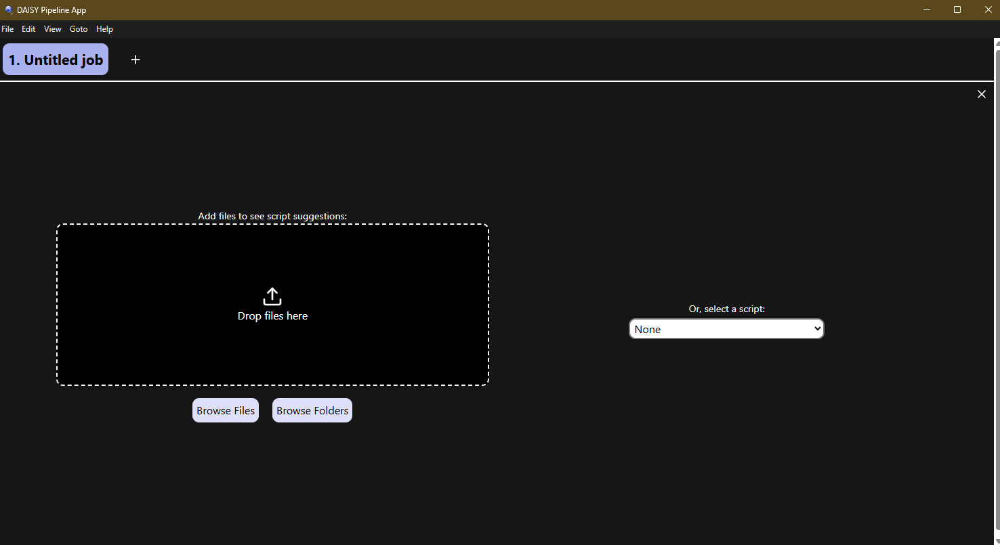
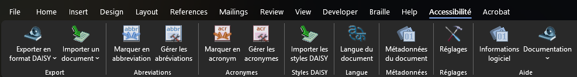

# Jour 1 – Après-midi

## Produire et utiliser  
## des fichiers XML DTBook

Notes:
Bienvenue dans la session pratique de ce premier après-midi. Nous allons mettre en œuvre les connaissances acquises ce matin en utilisant les outils du DAISY Consortium pour produire et manipuler des fichiers XML DTBook.

---

## Au programme cet après-midi

1. Les logiciels du DAISY Consortium pour produire du XML DTBook
   - L'application *DAISY Pipeline App*
   - Le complément Word *SaveAsDAISY*
2. Du XML DTBook à Word *(exercices pratiques)*
3. Structurer un document dans Word *(exercices pratiques)*
4. Convertir un fichier Word en XML DTBook *(exercices pratiques)*

Notes:
Cet après-midi est organisé en quatre parties. Nous commençons par une présentation des outils, puis nous enchaînons avec trois exercices pratiques progressifs : d'abord comprendre un fichier DTBook existant en le convertissant en Word, puis structurer un document Word correctement, et enfin le convertir en XML DTBook.

---

## Retour sur le matin

- Le XML DTBook est un format structuré pour les livres accessibles
- Il utilise des balises sémantiques (`<level1>`, `<h1>`, `<p>`…)
- On peut le lire avec un éditeur texte ou un outil XML

**Mettons-le en pratique ! 🛠️**

Notes:
Pour rappel, le XML DTBook est le format numérique développé par le DAISY Consortium pour les livres accessibles. Sa structure hiérarchique (level1 à level6) correspond aux chapitres et sections d'un ouvrage. Aujourd'hui nous allons voir comment produire ce format à partir de documents Word, et inversement.

---

# Partie 1

## Les logiciels du DAISY Consortium

Ce que l'on va installer :
- DAISY Pipeline (App)
- SaveAsDAISY (complément word)

Notes:
Le DAISY Consortium propose plusieurs outils gratuits et open source pour la production de publications accessibles. Nous allons nous concentrer sur les deux outils principaux utilisés dans notre chaîne de production : DAISY Pipeline et SaveAsDAISY.

---

## DAISY Pipeline

**DAISY Pipeline** : *serveur* de conversion de documents accessibles

- 🌐 Site : [daisy.org/activities/software/pipeline](https://daisy.org/activities/software/pipeline)
- 💻 Disponible sur Windows, macOS, Linux
- 🔄 Nombreuses conversions :
  - DTBook → ODT, RTC, EPUB3, DAISY3...
  - Word → XML DTBook, EPUB3, DAISY3
  - ...

**[DAISY Pipeline app](https://github.com/daisy/pipeline-ui/releases/latest)** : version *bureau* du pipeline

Notes:
DAISY Pipeline est l'outil de transformation central du DAISY Consortium. Il fonctionne sur la base de scripts de transformation XSLT et propose une interface graphique simple pour les utilisateurs non techniques. Il peut traiter des fichiers par lots, ce qui est très utile pour les centres de transcription qui produisent de nombreux ouvrages.

---

## DAISY Pipeline App




Sélection d'un fichier ou d'un script de conversion pour démarrer
- Organisation en *Scripts* et *Jobs*
- Traitement par lots possible

Notes:
Le fonctionnement de DAISY Pipeline est basé sur des scripts de transformation. Chaque script correspond à une conversion entre deux formats. L'utilisateur choisit le script approprié, fournit le fichier source et le dossier de destination, et lance la conversion. Le traitement par lots permet de convertir plusieurs fichiers en une seule opération.

---

## Le complément Word SaveAsDAISY

**SaveAsDAISY** est un complément Microsoft Word
- 🌐 Site : [daisy.org/activities/software/save-as-daisy-ms-word-add-in/](https://daisy.org/activities/software/save-as-daisy-ms-word-add-in/)
- 🖥️ Compatible Word 2010 – 2019 / Office 365
- ⚙️ Ajoute un onglet *Accessibilité* dans Word

**Fonctionnalités :**
- Exporter un document Word en XML DTBook, ou DAISY, ou EPUB
- Ajouter des styles spécifiques DAISY
- Modifier les métadonnées

Notes:
SaveAsDAISY est un complément qui s'installe directement dans Microsoft Word. Une fois installé, il ajoute un nouvel onglet « DAISY » dans le ruban de Word, accessible depuis lequel vous pouvez exporter vers différents formats accessibles. C'est l'outil le plus simple pour un producteur qui travaille déjà dans Word, car il ne nécessite pas de changer d'application.

---

## SaveAsDAISY – Onglet *Accessibilité*



Notes:

(Démo en live)

---

## SaveAsDAISY – Onglet *Accessibilité*


| Bouton | Action |
|--------|--------|
| **Exporter en format DAISY** | Convertir le document en **XML DTBook**, *DAISY3*, *EPUB3*, *MP3s* ou *DAISY2.02* |
| **Importer un document** | Convertir un **XML DTBook** en fichier ouvrable par Word |
| **Marquer en abbréviation** | Marquer un mot sélectionné en abbréviation |
| **Gérer les abbréviation** | Gérer les abbréviations identifiés |
| **Marquer en acronyme** | Marquer un mot sélectionné en abbréviation |
| **Gérer les acronymes** | Gérer les acronymes identifiés  |

Notes:

(Démo en live)

---


## SaveAsDAISY – Onglet *Accessibilité*

| Bouton | Action |
|--------|--------|
| **Importer les styles DAISY** | Importer dans le document les styles de structuration |
| **Langue du document** | Modifie la langue de controle et d'export du document ou d'un texte sélectionné |
| **Métadonnées du document** | Gérer les métadonnées d'accessibilité du document |
| **Réglages** | Options du compléments et du moteur de conversion embarqué |
| **Informations logiciels** | Fenêtre d'information sur la version installé du complément |
| **Documentation** | Accès au manuel utilisateur et aux recommandations de structuration du complément |

Notes:

(Démo en live)

---

# Partie 2

## Du XML DTBook à Word *(exercices)*

Notes:
Dans cette partie, nous allons voir comment récupérer des fichiers DTBook et les convertir en Word pour les modifier ou les utiliser comme base de travail.

---

## Où récupérer des fichiers DTBook ?

Quelques sources de fichiers XML DTBook pour vos essais :

| Source | Description |
|--------|-------------|
| **[Echantillons du DAISY Consortium](https://daisy.org/info-help/document-archive/sample-files/)** | Fichiers d'exemple sur daisy.org |
| **[Echantillon du DAISY Pipeline](https://github.com/daisy/pipeline-samples/tree/master/dtbook)** | Fichiers d'exemples et de tests pour le DAISY Pipeline.org |
| **[Les exemples pour ce cours](https://github.com/studio-PAON-AVH/formation-fisaf-fichiers-structures/tree/main/slides/exercices)**| Fichiers pour ce cours |

Et quand vous serez transcripteurs :

| Source | Description |
|--------|-------------|
| **[Serveur hélène](https://serveur-helene.org/)** | Serveur d'échange de fichier de transcription (*to be closed*) |
| **[PLATON](https://exceptionhandicap.bnf.fr/)** | Service d'échange de fichier de transcription de la BNF |

Notes:
Voici quelques addresses ou vous pourrez trouvez des fichiers dtbooks pour vous entrainer et pour réaliser les exercices.

Le serveur hélène a été racheté par l'Association Valentin Haüy. Ses fichiers DTBook seront progressivement mis à disposition via la plateforme PLATON, qui devient ainsi le point d'accès unique pour les transcriptions accessibles en France.


---

## Convertir un DTBook en fichier Word

**Via DAISY Pipeline App :** *(demo live)*

1. Lancer DAISY Pipeline App
2. Choisir aux choix
  - le script **« DTBook to ODT »**
  - le script **« DTBook to RTF »**
3. Sélectionner le fichier DTBook source (`.xml`)
4. Définir le dossier de sortie
5. Lancer la conversion
6. Ouvrir le fichier `.docx` généré dans Word

Notes:
La conversion DTBook vers Word via DAISY Pipeline préserve la structure sémantique du fichier : les éléments level1/h1 deviennent des Titres 1 Word, les level2/h2 des Titres 2, etc. Les listes, tableaux et images sont également convertis.
Il peut subsister des ajustements à faire manuellement, notamment pour les mises en page complexes.

---

## 🛠️ Exercice 1

**À vous de jouer !**

1. Convertissez en *ODT* le fichiers [`exercice1.xml`](exercices/exercice1.xml)
  - cadeau : un [modèle OTT](exercices/dtbook-to-odt.ott)
2. Convertissez en *RTF* le fichiers [`exercice1.xml`](exercices/exercice1.xml)
3. Observer la structure des 2 résultats : styles, titres, paragraphes

**Durée : 15 minutes**

Notes:
Pour cet exercice, vous disposez d'un fichier DTBook préparé à l'avance. L'objectif est de se familiariser avec l'interface de DAISY Pipeline et d'observer comment la structure XML se traduit en styles Word. Prenez le temps d'explorer le fichier Word résultant : vérifiez le panneau de styles et la table des matières.

---

# Partie 3

## Structurer un document dans Word *(exercices)*

Notes:
La qualité d'un fichier DTBook (ou EPUB) dépend directement de la qualité de la structuration du document Word source. Cette partie est essentielle : une bonne structuration dès la saisie évite de nombreux problèmes lors de la conversion.

---

## Les règles d'accessibilité d'un document Word

**Règles fondamentales :**

1. 🏷️ **Styles de titres** : utiliser Titre 1, Titre 2, Titre 3… (jamais du gras seul)
2. 🖼️ **Images** : toujours renseigner le texte alternatif
3. 📋 **Listes** : utiliser les listes automatiques (pas de tirets manuels)
4. 📊 **Tableaux** : définir les en-têtes de colonnes
5. 🔗 **Liens** : un texte descriptif (pas « cliquez ici »)
6. 🌐 **Langue** : indiquer la langue du document
7. 📄 **Métadonnées** : titre, auteur, description

Notes:
Ces sept règles constituent la base de l'accessibilité d'un document Word. 
La plus importante est l'utilisation des styles de titres : sans eux, il n'y a pas de structure sémantique pour la navigation et la conversion ne peut pas produire un DTBook ou un EPUB de qualité.
Le vérificateur d'accessibilité intégré à Word (Révision → Vérifier l'accessibilité) peut aider à identifier une partie de ses problèmes, mais pas ceux sur les niveaux de titres et les métadonnées.

---

## Structure hiérarchique recommandée

```
Document Word
├── Titre 1 : Chapitre 1
│   ├── Titre 2 : Section 1.1
│   │   └── Titre 3 : Sous-section 1.1.1
│   └── Titre 2 : Section 1.2
├── Titre 1 : Chapitre 2
│   └── Titre 2 : Section 2.1
└── Titre 1 : Conclusion
```

**Important :** Ne pas sauter de niveau (pas de Titre 3 après Titre 1) !

Notes:
La hiérarchie des titres doit être respectée sans sauter de niveaux. 
Un Titre 3 doit toujours être précédé d'un Titre 2, lui-même précédé d'un Titre 1. Sauter des niveaux (par exemple passer directement de Titre 1 à Titre 3) crée des incohérences dans la structure qui seront répercutées dans le DTBook et l'EPUB, et peuvent nuire à la navigation.

---

## Les styles SaveAsDAISY

Styles complémentaires pour la structuration

> Finissant en **(DAISY)** == **convertit en balises DTBook**

Exemples :
- *Covertitle (DAISY)* : `covertitle` (titre de couverture)
- *Bridgehead (DAISY)* :  `bridgehead` (intertitre)
- *Page Number (DAISY)* : `pagenumber` (numéro original de la page dans l'imprimé)
- *Blockquote (DAISY)* : `blockquote` (bloque de citation)

Notes:
Les styles DAISY étendent les possibilités de structuration de Word pour couvrir des éléments spécifiques à l'édition adaptée. 

---

## 🛠️ Exercice 2

**A vous de jouer/experimenter**

1. Récupérer [`exercice2.docx`](exercices/exercice2.docx)
2. Appliquer les **styles de titres** corrects (Titre 1, 2, 3…)
3. Ajouter les **textes alternatifs** des images
4. Utilisez les **styles DAISY** pour plus de sémantiques (poésie, auteurs etc.)
5. Renseigner les **métadonnées** (Fichier → Propriétés)
6. Vérifier avec le **Vérificateur d'accessibilité** Word
7. Enregistrer le résultat sous le nom `exercice2_structuré.docx`

**Durée : 30 minutes**

Notes:
Je vous donne un cas un peu emblématique : un texte "quasi brut" sans structuration "marqué" mais identifiable tout de même.

Ce que je vous passe ici est ce que vous pouvez récupérer depuis le projet gutemberg en "texte brute" (légèrement modifié pour reproduire les paragraphes).

Pour info :
-- = tiret quadratin
_mot_ = italique
__mot__= gras
Titre en majuscule

Votre objectif c'est d'avoir en sortie un document word structuré qui passe le vérificateur d'accessibilité.

(exemple)

---

# Partie 4

## Convertir un fichier Word en XML DTBook *(exercices)*

Notes:
Cette dernière partie boucle le cycle de production : après avoir structuré notre document Word, nous allons l'exporter en XML DTBook et vérifier le résultat.

---

## Processus de conversion Word → DTBook

```
[Document Word structuré]
         ↓
   [Vérification accessibilité word]
   Structure correcte ? alt texte ?
         ↓
  [SaveAsDAISY Add-in]
   Onglet Accessibilité → Exporter → DAISY XML
         ↓
[Fichier XML DTBook généré]
```

Notes:
Le processus de conversion est simple lorsque le document Word est correctement structuré.
SaveAsDAISY lit les styles Word et les traduit en éléments DTBook correspondants. 
Il est préférable d'utiliser d'abord le vérificateur d'accessibilité Word.

---

## Bonnes pratiques avant la conversion

Checklist avant d'exporter :

- ☑ Tous les titres utilisent les styles Word Titre 1/2/3…
  - Hierarchie sans "vide"
  - Se verra dans le panel "navigation"
- ☑ Toutes les images ont un texte alternatif
- ☑ Les listes sont bien marquées avec un style de puces ou numéro
- ☑ La langue du document est définie
- ☑ Les métadonnées (titre, auteur etc.) sont renseignées
- ☑ Le vérificateur d'accessibilité Word ne signale pas d'erreur

Notes:
Cette checklist doit être complétée avant chaque export. 
Il vaut mieux prendre quelques minutes pour vérifier ces points que de découvrir des problèmes dans le fichier DTBook généré. 
La règle d'or : si le vérificateur d'accessibilité Word signale des erreurs, corrigez-les avant d'exporter.

---

## 🛠️ Exercice 3

**Convertir le document Word en XML DTBook**

1. Ouvrir le document structuré de l'exercice 2
2. Cliquer sur l'onglet **Accessibilité** dans Word
3. Cliquer sur **« Exporter / DAISY XML »**
4. Choisir le dossier de destination
5. Ouvrir le fichier `.xml` généré dans un éditeur
6. Vérifier la structure XML produite

**Durée : 20 minutes**

Notes:
Pour cet exercice, utilisez le document que vous avez structuré lors de l'exercice 2. Une fois le DTBook généré, ouvrez-le dans Notepad++ ou Visual Studio Code et examinez sa structure : vérifiez que les niveaux level1/level2 correspondent bien aux titres Word, que les images ont bien un élément imggroup avec une description, et que les métadonnées sont correctement renseignées dans l'en-tête.

---

## Points clés à retenir – Après-midi J1

- 🔧 **DAISY Pipeline** convertit entre de nombreux formats accessibles
- 📝 **SaveAsDAISY** intègre la conversion directement dans Word
- 🏗️ La **structuration Word** (styles de titres) est la clé d'une bonne conversion
- ✅ Le **vérificateur d'accessibilité** Word est un allié précieux
- 📄 Le XML DTBook généré reflète fidèlement la structure du Word source

Notes:
Pour résumer cette après-midi : la qualité du fichier DTBook (ou EPUB) produit est directement proportionnelle à la qualité de la structuration du document Word source. Les outils ne peuvent pas compenser une mauvaise structuration. L'investissement dans la structuration dès la saisie est toujours rentable à long terme.

---

## Récapitulatif de la journée 1

| Session | Contenu |
|---------|---------|
| Matin | Histoire de l'édition accessible, XML, DTBook |
| Après-midi | Outils DAISY, conversion Word↔DTBook, structuration |

**Demain : le format EPUB ! 📱**

Notes:
Nous avons couvert aujourd'hui les bases théoriques et pratiques de l'édition adaptée avec le format XML DTBook. Demain matin, nous aborderons le format EPUB3, son histoire, et les outils disponibles. L'après-midi sera consacrée à la production d'EPUBs accessibles et à leur validation.
