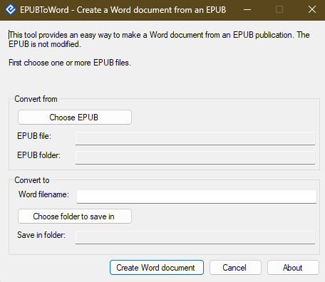
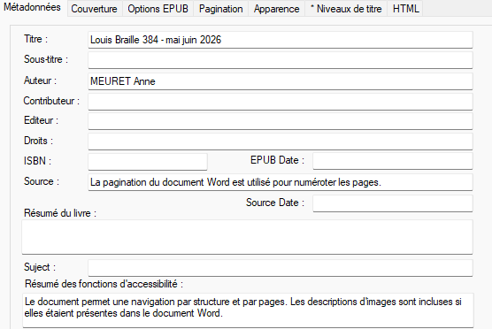
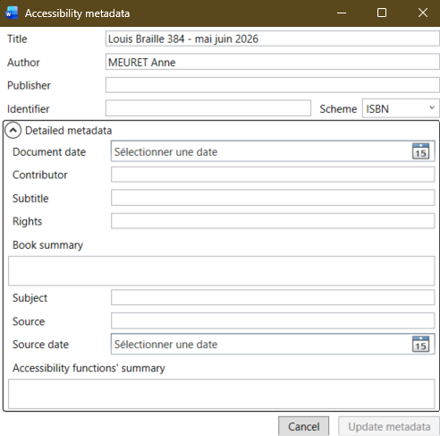

# Jour 2 – Après-midi

## Produire des EPUBs accessibles

Notes:
Bienvenue dans cette dernière session de la formation. Cet après-midi est entièrement consacré à la pratique : nous allons produire des EPUBs accessibles, les tester et les valider.

---

## Au programme cet après-midi

1. Convertir un fichier EPUB vers Word
   - Via Calibre/Codex
   - Via WordToEPUB du DAISY Consortium
2. Retour à la structuration dans Word
   - Structuration et métadonnées
3. Générer un EPUB accessible *(exercices)*
   - Via WordToEPUB
   - Via SaveAsDAISY
   - Créer un EPUB Media Overlay
4. Contrôler et valider un EPUB

Notes:
Cet après-midi comprend quatre parties. Nous commençons par voir comment récupérer un fichier Word à partir d'un EPUB existant, puis nous revoyons la structuration dans Word avant de nous concentrer sur la production d'EPUBs accessibles avec deux outils différents. Nous terminerons par la validation technique et d'accessibilité.

---

# Partie 1

## Convertir un EPUB vers Word

Notes:
Cette première partie couvre la conversion dans le sens inverse : partir d'un EPUB existant pour obtenir un fichier Word modifiable. C'est utile lorsqu'on reçoit un EPUB sans le fichier Word source.

---

## 1.a – Via Calibre/Codex

**Calibre** peut convertir un EPUB en DOCX :

1. Ouvrir Calibre et importer le fichier EPUB
2. Sélectionner le livre → **Convertir les livres**
3. Choisir le **format de sortie : DOCX**
4. Options de conversion :
   - Conserver les styles
   - Convertir les images
   - Structure des chapitres
5. Lancer la conversion
6. Exporter et ouvrir dans Word

⚠️ La qualité dépend de la structure de l'EPUB source

Notes:
La conversion EPUB vers DOCX via Calibre fonctionne bien pour les EPUBs bien structurés. Le résultat peut nécessiter des ajustements, notamment pour les styles qui ne correspondent pas exactement aux styles Word natifs. Pour les EPUBs Fixed Layout ou avec des mises en page complexes, la conversion sera moins fidèle.

---

## Via WordToEPUB du DAISY Consortium


**[WordToEPUB](https://daisy.org/wordtoepub)**, complément word du DAISY Consortium

- Spécialisé dans la **conversion Word → EPUB 3 accessible**

> **Il peut aussi reconvertir un EPUB en Word :**

Outils `EPUBToWord.exe` *caché* dans `C:\Program Files (x86)\DAISY\WordToEPUB`



Notes:
WordToEPUB traite les fichiers localement dans votre navigateur, ce qui garantit la confidentialité de vos documents : aucun fichier n'est envoyé vers un serveur distant. C'est un avantage important pour les structures qui traitent des documents sous droit d'auteur. Son principal usage est la conversion Word → EPUB, mais il peut aussi aider à extraire le contenu d'un EPUB.

---

## Bonne pratique : conserver vos fichiers

Hormis si le fichier est un manuscrit d'un éditeur

<small>(protégé par le droit d'auteur)</small>

> **Conserver votre fichier Word de travail**  
> C'est la meilleure base pour toute modification ou reconversion.

Flux de travail recommandé :

```
[Source Word structurée] → [EPUB accessible]
         ↑                        ↓
    Modifications          Validation / Corrections
         ↑                        ↓
    [Source Word mise à jour] ← [Retour si nécessaire]
```

Notes:
La conservation du fichier Word source est une règle d'or de la production d'EPUBs. Toute modification ultérieure (correction d'erreur, mise à jour du contenu, reconversion dans un nouveau format) sera beaucoup plus simple et fiable à partir du Word structuré que depuis l'EPUB. Il est recommandé de versionner les fichiers sources et de les archiver systématiquement.

---

# Partie 2

## Retour à la structuration dans Word

Notes:
Avant de générer nos EPUBs, rappelons les règles de structuration dans Word. La qualité de l'EPUB produit dépend directement de la qualité de la structuration du fichier source.

---

## Rappel : structuration dans Word

Les éléments essentiels pour un EPUB de qualité :

| Élément | Règle |
|---------|-------|
| **Titres** | Utiliser les styles Titre 1, 2, 3 |
| **Paragraphes** | Style Corps de texte ou Normal |
| **Listes** | Listes automatiques (puces/numéros) |
| **Images** | Texte alternatif obligatoire |
| **Tableaux** | Ligne d'en-tête définie |
| **Notes de bas de page** | Via l'outil Word dédié |

Notes:
Ces règles sont identiques à celles que nous avons vues hier pour la production de DTBook. C'est une force de l'approche WYSIWYM : un document bien structuré dans Word peut être converti en DTBook, en EPUB ou dans d'autres formats avec une bonne qualité. La structuration est faite une seule fois et sert pour tous les formats de sortie.

---

## Les métadonnées pour l'accessibilité

Les métadonnées du document, via Word :

**Fichier → Informations → Propriétés**

<small>et cliquer sur *Montrer toutes les propriétés*</small>

| Métadonnée | Exemple |
|------------|---------|
| **Titre** | Titre du document (obligatoire dans SaveAsDAISY) |
| **Auteur** | Nom de l'auteur |
| **Langue** | Langue principal du document |
| **Entreprise** | correspondance pour l'éditeur du livre|
| **Sujet** | Mots-clés descriptifs |
| **Commentaire** | Résumé de l'ouvrage |

Ces métadonnées seront intégrées dans l'EPUB généré.

Notes:
Les métadonnées Word sont récupérées par les outils de conversion et intégrées dans les fichiers de métadonnées de l'EPUB (content.opf). Il est important de les renseigner correctement avant la conversion. Le titre et la langue sont les plus critiques pour l'accessibilité : le titre sera affiché dans la liseuse et la langue est nécessaire pour la synthèse vocale.

---

## Métadonnées d'accessibilité supplémentaires


Problèmes JOUR 1 : il manque des métadonnées !

**Dans WordToEPUB**




Inclus des raccourcis vers les métadonnées de word

---

## Métadonnées d'accessibilité supplémentaires

Problèmes JOUR 1 : il manque des métadonnées !

**Dans SaveAsDAISY**



Inclus des raccourcis vers les métadonnées de word

Notes:
Ces métadonnées supplémentaires sont spécifiques à l'accessibilité EPUB. Elles permettent d'indiquer précisément comment le livre peut être lu (mode textuel seulement, ou aussi visuel/auditif), quelles fonctionnalités d'accessibilité il supporte, et à quel niveau de conformité WCAG il répond. WordToEPUB et SaveAsDAISY proposent des interfaces guidées pour renseigner ces informations.

---

# Partie 3

## Générer un EPUB accessible *(exercices)*

Notes:
Passons maintenant à la pratique. Nous allons générer des EPUBs accessibles avec deux outils différents, puis créer un EPUB avec synchronisation audio.

---

## Conversion via WordToEPUB

**WordToEPUB** : conversion Word → EPUB 3 accessible

1. 🌐 Aller sur [daisy.org/wordtoepub](https://daisy.org/wordtoepub)
2. Télécharger et installer `WordToEPUB`
2. Cliquer sur **« Choisir un fichier »** et sélectionner le DOCX
3. Configurer les options :
   - Langue du document
   - Métadonnées de l'ouvrage
   - Options d'accessibilité
4. Cliquer sur **« Convertir »**
5. Télécharger le fichier EPUB généré

✅ Avantage : simple, fichier epub accessible, éditeur de couverture
❌ controle limité de la sémantique, seulement du texte

Notes:
WordToEPUB est l'outil le plus simple pour produire un EPUB 3 accessible à partir de Word. Il gère automatiquement la structure de l'EPUB, la table des matières, et propose un assistant pour les métadonnées d'accessibilité. Seule limitation : il ne supporte pas les Media Overlays (synchronisation audio). Pour les livres audio structurés, il faudra utiliser SaveAsDAISY.

---

## 🛠️ Exercice 4

**Convertir un Word en EPUB accessible avec WordToEPUB**

1. Ouvrir [daisy.org/wordtoepub](https://daisy.org/wordtoepub)
2. Charger le fichier `exercice4.docx`
3. Renseigner les métadonnées (titre, auteur, langue)
4. Lancer la conversion
5. Télécharger et ouvrir l'EPUB dans Thorium Reader
6. Tester la navigation (table des matières, titres)

**Durée : 20 minutes**

Notes:
Pour cet exercice, utilisez le fichier exercice4.docx fourni. Après la conversion, testez soigneusement l'EPUB dans Thorium Reader : vérifiez que la table des matières est complète et navigable, que les titres sont bien hiérarchisés, et que les images s'affichent correctement avec leur texte alternatif. Nous utiliserons cet EPUB dans les exercices de validation qui suivent.

---

## Conversion via SaveAsDAISY

**Depuis Word avec le complément SaveAsDAISY :**

1. Ouvrir le document Word structuré
2. Cliquer sur l'onglet **Accessibilité**
3. Sélectionner **Exporter en format DAISY**
4. Configurer :
   - Titre, auteur, langue
   - Options d'accessibilité
   - Couverture (optionnel)
5. Choisir le dossier de destination
6. Lancer l'export

Notes:
SaveAsDAISY produit également des EPUBs 3 accessibles directement depuis Word. La configuration est similaire à WordToEPUB mais l'interface est intégrée dans Word. Un avantage de SaveAsDAISY est la possibilité de sauvegarder les paramètres de configuration pour les réutiliser lors de conversions ultérieures.

---

## Comparatif WordToEPUB vs SaveAsDAISY

| Critère | WordToEPUB | SaveAsDAISY |
|---------|------------|-------------|
| **Mode** | En ligne | Dans Word |
| **Installation** | Aucune | Complément Word |
| **Métadonnées d'accessibilité** | ✅ Guidé | ✅ Disponible |
| **EPUB Media Overlay** | ❌ | ✅ |
| **DTBook** | ❌ | ✅ |
| **Facilité d'utilisation** | ⭐⭐⭐⭐ | ⭐⭐⭐ |

Notes:
Le choix entre WordToEPUB et SaveAsDAISY dépend de vos besoins. WordToEPUB est plus simple et ne nécessite aucune installation, ce qui en fait un bon point d'entrée. SaveAsDAISY est plus complet : il supporte les Media Overlays pour les livres audio structurés et peut aussi exporter en DTBook. Pour une production régulière de livres adaptés avec audio, SaveAsDAISY est recommandé.

---

## 3.c – Créer un EPUB Media Overlay avec SaveAsDAISY

**Media Overlay** = synchronisation texte + audio dans un EPUB 3

**Principe :**
1. Préparer le document Word structuré
2. Enregistrer une narration audio (ou utiliser une synthèse vocale)
3. Dans SaveAsDAISY : **Exporter EPUB avec Media Overlay**
4. L'audio se synchronise mot à mot ou phrase par phrase

Notes:
Les EPUB Media Overlay sont une fonctionnalité puissante d'EPUB 3 qui permet de synchroniser le texte avec un enregistrement audio. Lors de la lecture, le texte est mis en surbrillance au fur et à mesure de la narration, à la manière d'un karaoké. C'est particulièrement bénéfique pour les personnes dyslexiques et pour l'apprentissage des langues. SaveAsDAISY automatise la création du fichier SMIL de synchronisation.

---

## EPUB Media Overlay – Schéma de fonctionnement

```
[Texte XHTML]          [Fichiers Audio MP3]
     ↓                        ↓
[Fichier SMIL - Synchronisation]
     ↓
[EPUB 3 avec Media Overlay]
     ↓
[Lecture synchronisée dans Thorium / EasyReader]
```

**Usage :** livres audio structurés, ouvrages pour lecteurs avec difficultés de lecture

Notes:
Le fichier SMIL (Synchronized Multimedia Integration Language) est le cœur du Media Overlay. Il contient les références temporelles qui associent chaque segment audio à l'élément XHTML correspondant. SaveAsDAISY génère automatiquement ces fichiers SMIL lors de l'export. Le résultat est lisible dans Thorium Reader et EasyReader, les deux liseuses qui supportent les Media Overlays.

---

## 🛠️ Exercice 5

**Créer un EPUB avec Media Overlay**

1. Utiliser le fichier `exercice5.docx` + `exercice5-audio.mp3`
2. Ouvrir Word avec le complément SaveAsDAISY
3. Aller dans l'onglet **DAISY** → **« Exporter EPUB avec Media Overlay »**
4. Associer le fichier audio
5. Générer l'EPUB
6. Ouvrir dans Thorium Reader et tester la lecture synchronisée

**Durée : 25 minutes**

Notes:
Pour cet exercice, vous disposez d'un document Word et d'un fichier audio enregistré à l'avance. Après la génération de l'EPUB, testez la lecture synchronisée dans Thorium Reader : activez l'option de lecture audio et observez comment le texte est mis en surbrillance. Vérifiez également que la navigation par chapitre fonctionne avec la synchronisation audio.

---

# Partie 4

## Contrôler et valider un EPUB

Notes:
La production d'un EPUB ne s'arrête pas à la conversion. Il est indispensable de valider le fichier produit pour s'assurer qu'il est techniquement correct (EPUBCheck) et accessible (ACE). Cette étape de validation fait partie intégrante du workflow de production.

---

## Contrôler un EPUB avec EPUBCheck

**EPUBCheck** est l'outil de validation officiel du W3C

- 🌐 [github.com/w3c/epubcheck](https://github.com/w3c/epubcheck)
- Outil en ligne de commande (Java)
- Vérifie la **conformité technique** au standard EPUB
- Détecte les erreurs de structure, de métadonnées, de liens…


Notes:
EPUBCheck est l'outil de référence pour la validation technique des EPUBs. Il est utilisé par les éditeurs, les bibliothèques et les distributeurs pour vérifier la conformité des fichiers avant publication. Un EPUB qui ne passe pas EPUBCheck sans erreur peut poser des problèmes dans certaines liseuses ou lors de la distribution. EPUBCheck ne vérifie pas l'accessibilité (c'est le rôle d'ACE), mais seulement la conformité technique au standard EPUB.

Nous ne le testeront pas ici, parceque je ne me sens pas de vous faire faire de la ligne de commande.

---

## EPUBCheck – Types d'erreurs détectées

| Type | Exemple |
|------|---------|
| **Erreur fatale** | Archive ZIP corrompue |
| **Erreur** | Fichier manquant référencé dans l'OPF |
| **Avertissement** | Attribut déprécié |
| **Info** | Caractéristique EPUB 3 utilisée |

**Objectif :** 0 erreur, 0 avertissement (ou justifiés)

Notes:
Les erreurs fatales empêchent complètement la lecture de l'EPUB. Les erreurs signalent des non-conformités qui doivent être corrigées. Les avertissements indiquent des pratiques déconseillées qui peuvent poser problème sur certaines liseuses. L'objectif est d'obtenir un rapport EPUBCheck sans erreur ni avertissement, ou en pouvant justifier chaque avertissement restant.

---

## Contrôler un EPUB avec ACE du DAISY Consortium

**ACE** (*Accessibility Checker for EPUB*) est l'outil d'audit d'accessibilité

- 🌐 [daisy.org/ace](https://daisy.org/ace)
- Développé par le DAISY Consortium
- Vérifie la **conformité WCAG** et **EPUB Accessibility**
- Génère un rapport HTML détaillé

**Installation :**
```bash
npm install -g @daisy/ace
ace --version
```

Notes:
ACE (Accessibility Checker for EPUB) est le complément d'EPUBCheck pour l'accessibilité. Là où EPUBCheck vérifie la conformité technique, ACE vérifie les critères WCAG et EPUB Accessibility 1.1. ACE est disponible en ligne de commande via npm (Node.js) et génère un rapport HTML très lisible qui détaille chaque violation avec des explications et des recommandations de correction. Il existe aussi une interface graphique ACE App.

---

## ACE – Ce qu'il vérifie

| Critère | Vérification |
|---------|--------------|
| **Images** | Texte alternatif présent |
| **Structure** | Hiérarchie des titres correcte |
| **Langue** | Déclarée dans les métadonnées |
| **Tables** | En-têtes définis |
| **Liens** | Textes descriptifs |
| **Métadonnées** | Propriétés schema.org présentes |
| **Navigation** | Table des matières disponible |
| **Contraste** | Ratio de contraste suffisant |

Notes:
ACE vérifie automatiquement une liste de critères WCAG applicables aux EPUBs. Ces vérifications couvrent les problèmes les plus courants dans les EPUBs mal produits : images sans texte alternatif, structure de titres incohérente, langue non déclarée, métadonnées d'accessibilité manquantes. Certains critères WCAG ne peuvent pas être vérifiés automatiquement (par exemple, la pertinence d'une description alternative) : ACE les signale comme nécessitant une vérification manuelle.

---

## ACE – Rapport de conformité

Le rapport ACE inclut :

- 📊 **Score global** de conformité
- 🔍 **Liste des violations** avec explications
- 📋 **Données structurées** du livre analysé
- 💡 **Recommandations** de corrections
- 🏷️ **Vérification des métadonnées** d'accessibilité

Notes:
Le rapport HTML généré par ACE est très complet. Il inclut une visualisation de la structure du livre, une liste des violations organisées par critère WCAG, et pour chaque violation une explication et une suggestion de correction. Le rapport peut être partagé avec l'équipe de production ou archivé comme preuve de conformité. ACE génère également un fichier EARL (Evaluation And Report Language) en JSON pour une intégration dans des workflows automatisés.

---

## 🛠️ Exercice 6

**Analyser un EPUB avec ACE**

1. Lancer ACE sur le fichier EPUB de l'exercice 4 :
   ```
   ace monlivre.epub -o rapport-ace/
   ```
2. Ouvrir le rapport HTML généré
3. Analyser :
   - Violations détectées
   - Critères WCAG non respectés
4. Identifier les 3 principales améliorations possibles
5. Corriger dans le Word source et reconvertir

**Durée : 25 minutes**

Notes:
Pour cet exercice, utilisez l'EPUB de l'exercice 4. Si ACE est installé sur votre machine, exécutez la commande indiquée. Sinon, l'ACE App (interface graphique) peut être utilisée. Après l'analyse, identifiez les trois violations les plus impactantes pour l'accessibilité. Corrigez-les dans le Word source, convertissez à nouveau, et relancez ACE pour vérifier que les violations sont résolues.

---

## Workflow complet de production EPUB accessible

```
1. Rédaction dans Word
   (styles + métadonnées + images alt)
        ↓
2. Vérification Word
   (vérificateur d'accessibilité intégré)
        ↓
3. Conversion en EPUB
   (WordToEPUB ou SaveAsDAISY)
        ↓
4. Validation technique
   (EPUBCheck → 0 erreur)
        ↓
5. Audit accessibilité
   (ACE → conformité WCAG)
        ↓
6. Corrections et itérations
        ↓
7. Publication ✅
```

Notes:
Ce workflow en sept étapes représente la chaîne de production complète d'un EPUB accessible. Les étapes 4 à 6 forment une boucle d'itération : si des erreurs sont détectées, on corrige le fichier Word source et on recommence. Il est important de ne pas chercher à corriger directement dans l'EPUB : toute modification doit être faite dans le Word source pour garantir la cohérence entre les versions.

---

## Points clés à retenir – Après-midi J2

- 🔄 **Calibre** permet de convertir des EPUBs existants
- 🌐 **WordToEPUB** : outil en ligne simple pour EPUB 3 accessible
- 🔧 **SaveAsDAISY** : production dans Word, supporte les Media Overlays
- ✅ **EPUBCheck** : validation technique obligatoire (0 erreur)
- ♿ **ACE** : audit d'accessibilité complet selon WCAG et EPUB Accessibility

Notes:
Pour résumer cet après-midi : nous avons vu que la production d'un EPUB accessible est un processus itératif qui commence par une bonne structuration dans Word et se termine par une validation complète. Les outils WordToEPUB et SaveAsDAISY automatisent une grande partie du travail, mais la validation reste indispensable.

---

## Récapitulatif des 2 jours

| Session | Contenu |
|---------|---------|
| J1 Matin | Histoire, formats structurés, XML, DTBook |
| J1 Après-midi | DAISY Pipeline, SaveAsDAISY, Word → DTBook |
| J2 Matin | EPUB : formats, accessibilité, logiciels |
| J2 Après-midi | Production EPUB accessible, validation |

Notes:
Ces deux jours vous ont donné les bases théoriques et pratiques pour produire des publications numériques accessibles. Le format XML DTBook reste la référence pour les livres audio structurés, tandis que l'EPUB3 est le format de référence pour l'édition numérique grand public et accessible. Les deux partagent les mêmes principes de structuration sémantique.

---

## Ressources pour aller plus loin

| Ressource | URL |
|-----------|-----|
| **DAISY Consortium** | daisy.org |
| **WordToEPUB** | daisy.org/wordtoepub |
| **Thorium Reader** | edrlab.org/thorium-reader |
| **ACE** | daisy.org/ace |
| **EPUBCheck** | github.com/w3c/epubcheck |
| **EPUB Accessibility 1.1** | w3.org/TR/epub-a11y-11 |
| **WCAG 2.1** | w3.org/TR/WCAG21 |

Notes:
Ces ressources vous permettront de continuer à approfondir vos connaissances après la formation. Le site du DAISY Consortium propose notamment une base de connaissance très complète (kb.daisy.org) et inclusivepublishing.org propose des formations et ressources en ligne sur l'édition inclusive.

---

## Merci pour votre participation ! 🎉

**Formation FISAF – Fichiers Structurés  
pour la Transcription et l'Édition Numérique Adaptée**

_Questions ? Contactez-nous !_

Notes:
Merci pour votre participation active à cette formation. N'hésitez pas à nous contacter si vous avez des questions après la formation. Nous vous encourageons à mettre en pratique les techniques apprises dès vos prochaines productions.
